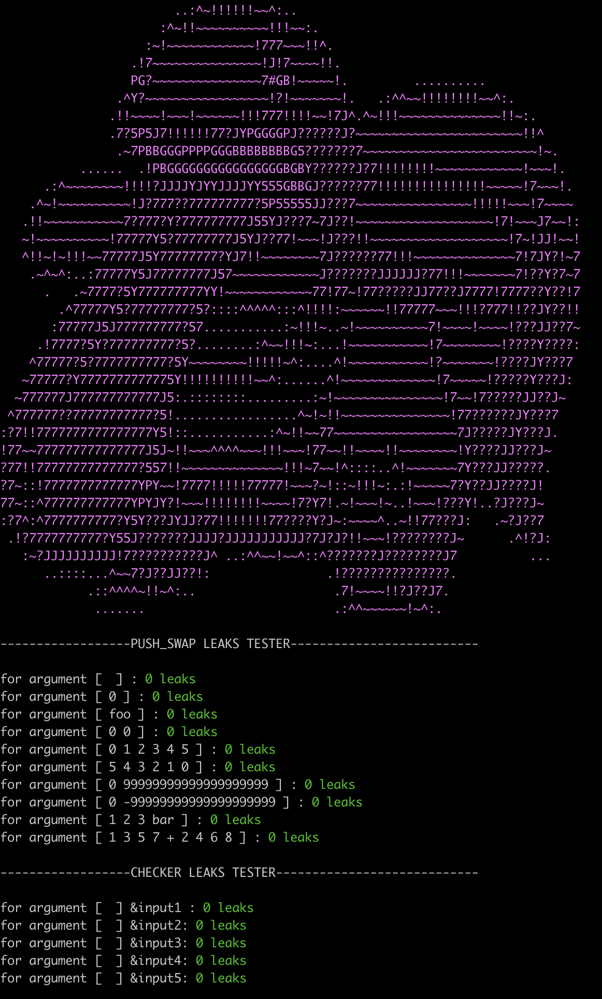

###    Push_Swap_Leaker 0.2a

Push_Swap_Leaker is a rude and dumb (very dumb) bash script utility for debugging the "42 school" project "push_swap".

It is not meant to fully debug your code, but as the name suggests, it solely tries to find memory leaks in the code by sending a battery of inputs to your two executables, and then grepping the "leaks --atExit" output from the stdout $(man leaks).

#INSTRUCTIONS:

Copy the directory anywhere, edit the psleaker.sh and change path and name of your executables, then simply run.

#NOTES

As per 0.1a version, it is only tested on MacOS environment, and it is most surely still lacking. Don't solely trust this tool as your code might break and leak by different means; try to get creative and implement new inputs and ARGs yourself.

#CONTACT @ Discord
sk3z#4948
